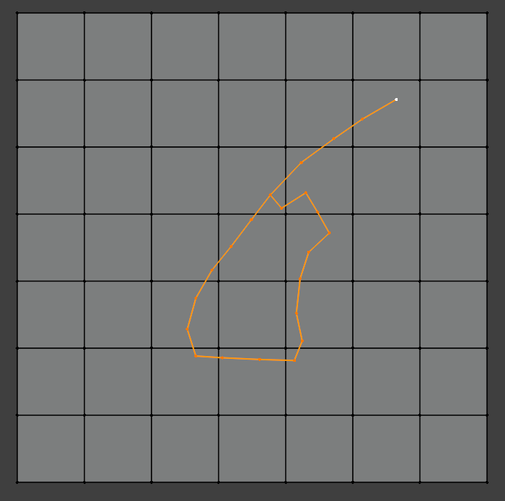
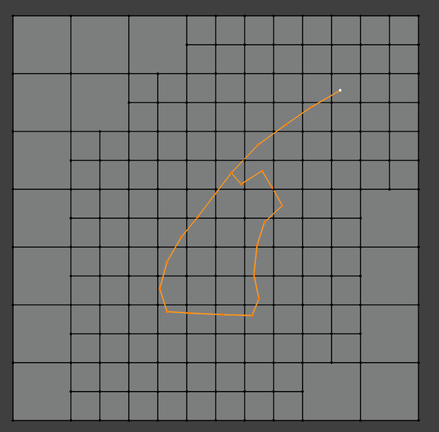
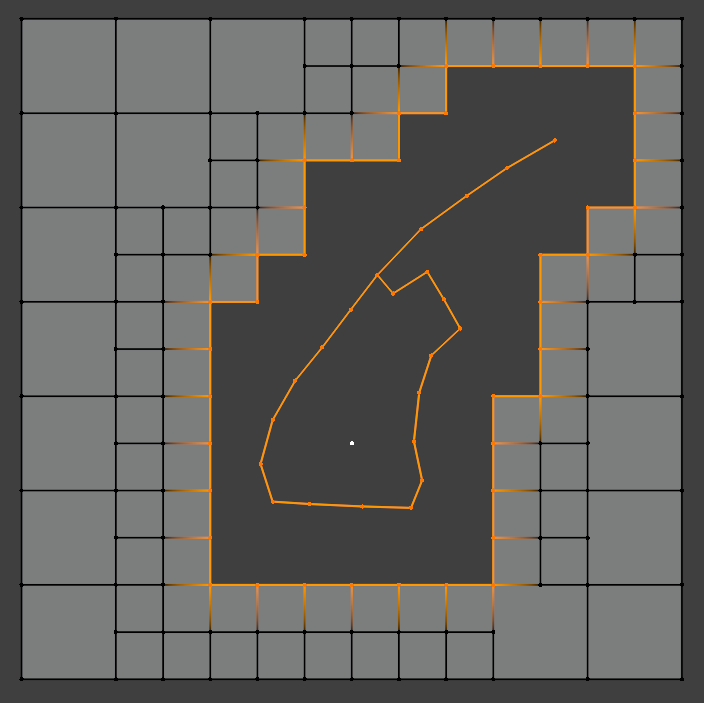
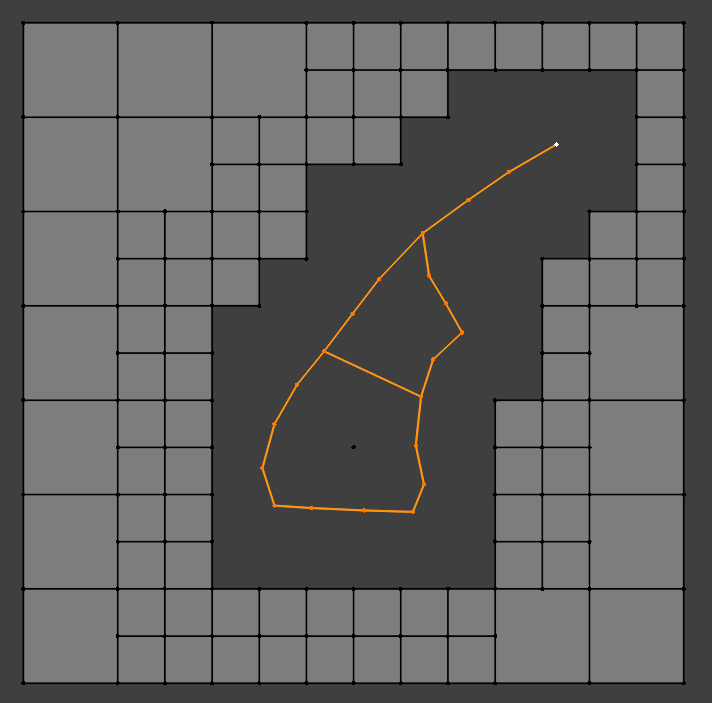
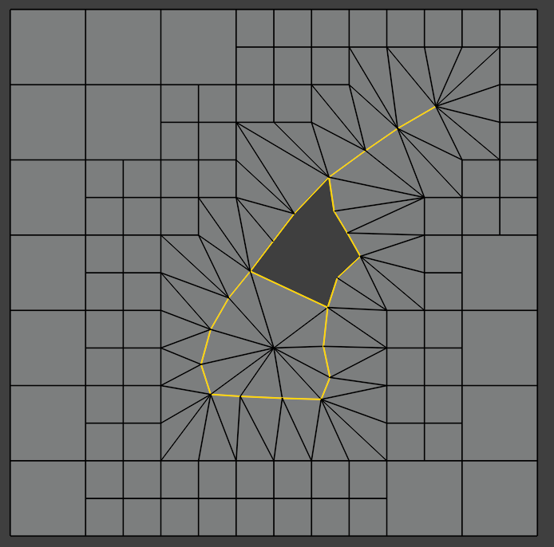
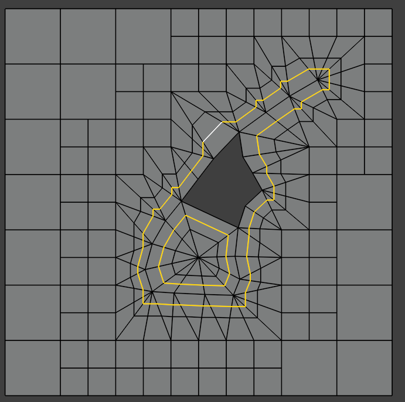
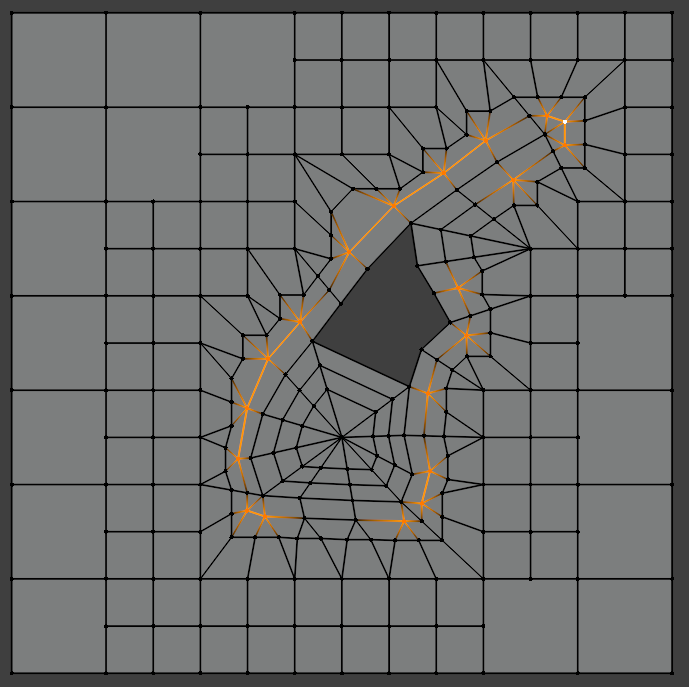
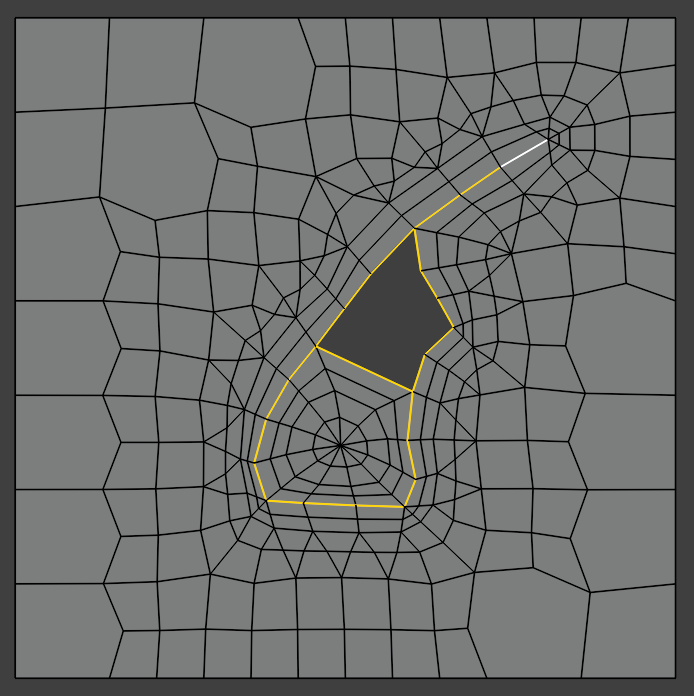

WeavyMesh
=========

*WeavyMesh* is currently an idea for a (semi-)automatic 3D volume mesh
generation procedure. The main idea is that in the meshing procedure,
a given 3D surface mesh is "weaved" or "stitched" into a 3D cubic octree
volume mesh. The procedure should create a fairly orthogonal boundary
layer in the mesh, which is expected to be hex-dominant.

Algorithm Description
---------------------

1. Background mesh generation is done by a cubic octree
decomposition. Refinement of background cells is based on the
proximity to the surface mesh, or edge intersections with the octree
mesh.

2. The cells in the background mesh which cut the surface mesh are
removed to create space for the weaved mesh. The boundary faces,
boundary edges and boundary points (e.g. white dot in the picture
below) remaining in the background mesh after the removal act as
"secondary side elements" in the weaving process, while the elements
of the surface mesh acts as "primary side elements".
Primary side elements are divided into patches (as provided by user)
and secondary side elements are divided into contiguous islands of
faces/edges/points (e.g. the white dot in the picture below is the
only element in that island).

Patches without boundary layers are also needed (e.g. inlets and
outlets). For these, background mesh cells could be cut at the patch
faces and only outside cells are removed.

3. Surface mesh is simplified to ensure that the weaving stage will
create manifold cells. Ray casting from primary and secondary surface
mesh face centres towards face normal direction (and/or from points
towards point normals) is made to evaluate "weavability" of each
surface face (or point). If ray hits opposite side face (possibly with
a check for alignment with the opposite side face normal direction?),
the weaving is deemed possible. Elements which can't be weaved (rays
hit only same side faces) are occluded and they are assumedly located
inside convex cavities. The cavity has to be filled, so the occluded
elements are "pushed outwards" (by point extrusion?). This
simplification procedure creates meshless voids into the domain.
Additional filling could be required if distance to closest secondary
side point is "too large", or secondary face normal direction
vs. closest point direction, is "too large"? Cavity filling so that
the resulting surface mesh is good might not be a trivial task?

4. The main weaving stage. Start by connecting two closest points on
primary and secondary side. Each neighbouring **face** on both the
primary side and secondary side are connected to **the closest
opposite weaved point** on the other side. This will create pyramid or
tetrahedral cells, depending on the shape of the base face. The
weaving is continued by connecting a neighboring face on either
primary or secondary side to the opposite side vertex. The algorithm
relies on the filling process to be complete, and to create manifold
cells: After weaving is done, there should be no voids left between
the primary and the secondary elements (is this possible in
practice?).

5. Subdivision of cells next to boundary surfaces. Cells are cut to
half (or some projected distance from the boundary) in the
normal-to-surface direction. This is repeated a second time.

.. image:: images/weavy_algorithm_06.png

6. Collapsing of small top faces on the first boundary cell layer. The
small "top" faces (assuming boundary faces are "bottom" faces) on the
boundary cell layer are collapsed away, except on sharp feature
edges. This will ensure most of boundary layer cells are
prismatic. Only the top faces near very sharp feature edges (>60 or
>90 deg?) need to be left uncollapsed.

7. The subdivision of the boundary cell layer can be repeated to
create more boundary layers. Finally (or after earlier stages), the
mesh is smoothened e.g. by constrained centroidal smoothing (see e.g.
`smoothMesh <https://github.com/tkeskita/smoothMesh>`_) to improve
mesh quality.

Thoughts
--------

- This procedure **separates the problem of surface meshing from
  volumetric meshing** (assuming the procedure actually works).
  This is a con from the user point of view, because it means that the
  surface mesh must be modelled a priori by the user, and a high
  quality is required (e.g. internal surface edges all must connect
  exactly two faces etc. manifoldness requirements) --> not a fully
  automated procedure. Possibly automatable with surface mesh
  retopology tools? Blender would be a good alternative to model the
  surface mesh. Would need to have a surface mesh quality inspection
  tool to show issues in the surface mesh.

- Generation of the background mesh could be automated later on, but
  at first it would be left to the user. Refined octree background
  mesh could be created with e.g. SnappyHexMesh.

- **Pros compared to SnappyHexMesh:** No need for separate snapping to
  surfaces or feature edges. No need for separate layer addition (mesh
  shrinking and existing cell deformations to add layers). OTOH the
  algorithm has more cell topology changes, cell removals etc. than
  Snappy.

- Boundary layers tend to have good orthogonality automatically!

- Creates very small cells at sharp edges, Courant might be limiting time
  stepping? OTOH, small cells at flow separation points might help with
  solution stability?

- Parallelization of the weaving step is not trivial to design.

- Supports conformal region meshing and baffles out-of-box.

- Uncertain how coarse background mesh is still practical, and how
  much free distance and face size difference is good for weaving,
  subdivision etc. regarding resulting mesh quality.
