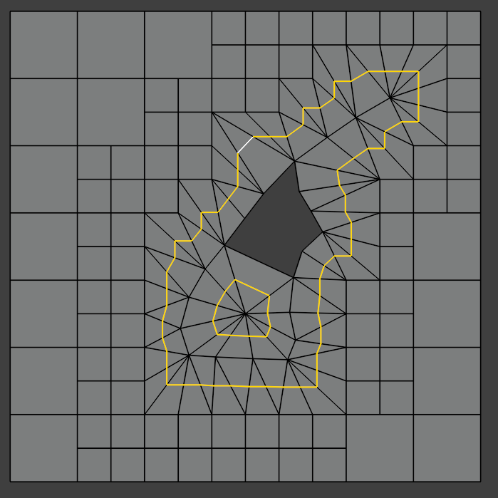

WeavyMesh
=========

*WeavyMesh* is currently an idea for a (semi-)automatic 3D volume mesh
generation procedure. The main idea is that in the meshing procedure,
a 3D surface mesh is "weaved" or "stitched" into a 3D cubic octree
volume mesh. The procedure should create a fairly orthogonal boundary
layer in the mesh, which is expected to be hex-dominant.

Algorithm Description
---------------------

1. Background mesh generation is done by a cubic octree
decomposition. Refinement of background cells is based on the
proximity to the surface mesh, or edge intersections with the octree
mesh.

.. image:: images/weavy_algorithm_01.png

.. image:: images/weavy_algorithm_02.png

2. The cells in the background mesh which cut the surface mesh are
removed to create space for the weaved mesh. The boundary faces,
boundary edges and boundary points (e.g. white dot in the picture
below) remaining in the background mesh after the removal act as
"secondary side elements" in the weaving process, while the elements
of the surface mesh acts as "primary side elements".

.. image:: images/weavy_algorithm_03.png

3. Surface mesh is decimated to ensure that the weaving stage will
create manifold cells. Ray casting from primary surface mesh face
centres towards face normal direction (or from primary points towards
point normals?) is made to evaluate "weavability" of each surface face
(or point?). If ray hits a secondary side face (possibly with a check
for alignment with secondary face normal direction?), the weaving is
deemed possible. Primary side faces which can't be weaved (ray hits a
primary face) are "pushed outwards" (point extrusion?) in a way which
creates meshless voids (this might not be a trivial task?). Additional
outward pushing could be made if distance to closest secondary side
point is "too large", or secondary face normal direction vs. closest
point direction, is "too large"?

.. image:: images/weavy_algorithm_04.png

4. The main weaving stage. Start by connecting two closest points on
primary and secondary side. Each neighbouring **face** on both the
primary side and secondary side are connected to **the closest
opposite weaved point** on the other side. This will create pyramid or
tetrahedral cells, depending on the shape of the base face. After
weaving is done, there should be no voids left between the primary and
the secondary elements. Not sure if there might be some issues to make
this process always produce in a manifold mesh?

5. Subdivision of cells next to boundary surfaces. Cells are cut to half in
the normal-to-surface direction. This is repeated a second time.

6. Collapsing of first layer small top faces. The small "top" faces
(assuming boundary faces are "bottom" faces) on the boundary cell
layer are collapsed away, except on sharp feature edges. This will
ensure most of boundary layer cells are prismatic. Only the top faces
near very sharp feature edges (>60 or >90 deg?) need to be left
uncollapsed.

7. The subdivision of the boundary cell layer can be repeated to
create more boundary layers. Finally (or after earlier stages), the
mesh is smoothened e.g. by constrained centroidal smoothing (see e.g.
`smoothMesh <https://github.com/tkeskita/smoothMesh>`_.

.. image:: images/weavy_algorithm_09.png

Thoughts
--------

- This procedure separates the problem of surface meshing from
  volumetric meshing (assuming the procedure actually works). 

- Surface mesh must be modelled a priori, and a high quality is
  required (e.g. internal surface edges all must connect exactly two
  faces etc. manifoldness requirements) --> not a fully automated
  procedure. Possibly automatable with surface mesh retopology tools?
  Blender would be a good alternative to model the surface mesh. Would
  need to have a surface mesh quality inspection tool?

- Generation of the background mesh is left to the user --> not a
  fully automated procedure. Refined octree mesh could be created with
  e.g. SnappyHexMesh.

- Compared to SnappyHexMesh: No need for snapping to surfaces or
  feature edges, no need for mesh shrinking and existing cell
  deformations to add layers. OTOH there are more cell topology
  changes, cell removals etc.

- Boundary layers tend to have good orthogonality automatically!

- Creates very small cells at sharp edges, Courant might be limiting time
  stepping? OTOH, small cells at flow separation points might help with
  solution stability?

- Parallelization of the weaving step is not trivial to design.

- Supports conformal region meshing and baffles.

- Uncertain how coarse background mesh is still practical, and how
  much free distance and face size difference is good for weaving,
  subdivision etc.
